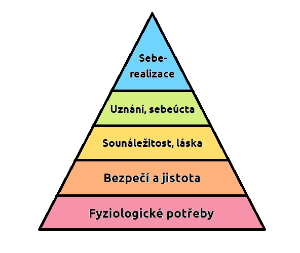

[zpět](../README.md)

# Lidské potřeby

## Cíl

- Firmy
  - max. zisku
- Lidí
  - max. užitku

**Pocit nedostatku => uspokojení potřeb**

## Znaky potřeb

1. Každý člověk má jiné potřeby
2. potřeby se vyvíjí a mění

## Maslowova pyramida potřeb

### 5 základních bodů

1. Seberealizace
2. Uznání a obdiv
3. Sounáležitost a láska
4. Bezpečí a životní jistoty
5. Fyziologické potřeby

### Vznik

- rok: 1943
- autor: [Abraham Maslow](https://cs.wikipedia.org/wiki/Abraham_Maslow) (americký psycholog)

